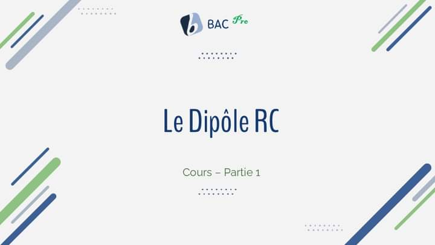

# Chap 02 Le dipole RC - Partie 1

- Cours Chap 02: Le dipole RC - Partie 1.
- [Découvrez notre cours complet sur YouTube](https://youtu.be/wQt4mt8wEqc)

## Objectifs

-Etablir l’équation différentielle qui régit la charge instantanée q (t) d’un condensateur, la tension uC(t) à ses bornes et l’intensité i(t) du courant qui parcourt le circuit de charge durant le régime transitoire.
 -Déterminer graphiquement, à partir des courbes de réponse uC(t) ou i(t) d’un dipôle RC soumis à un échelon de tension, la constante de temps τ = R.C.

## Liens Utiles

- [Chap.01 Le condensateur](https://youtu.be/t-_-3W4ihRg)
- [Chap 02: Le dipole RC - Partie 1](https://youtu.be/wQt4mt8wEqc)
- [Chap 02: Le dipole RC - Partie 2](https://youtu.be/V381RSkJu0w)
- [YouTube](https://www.youtube.com/@BacPro-tn)
- [Facebook](https://www.facebook.com/BacPro.tn)
- [Twitter (X)](https://www.x.com/@BACPro)
- [LinkedIn](https://www.linkedin.com/in/bacpro)
- [TikTok](https://www.tiktok.com/@bacpro.tn)
- [Instagram](https://www.instagram.com/bacpro.tn)
- [GitHub](https://www.github.com/Bacprotn)
